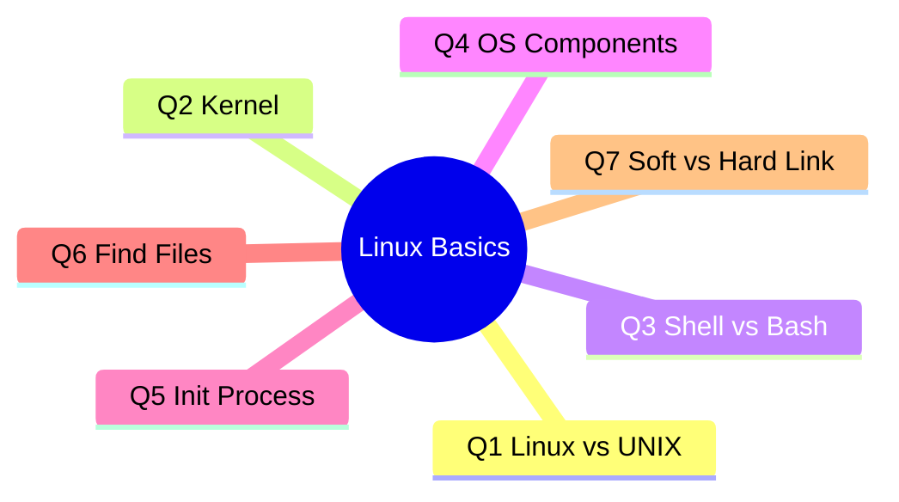
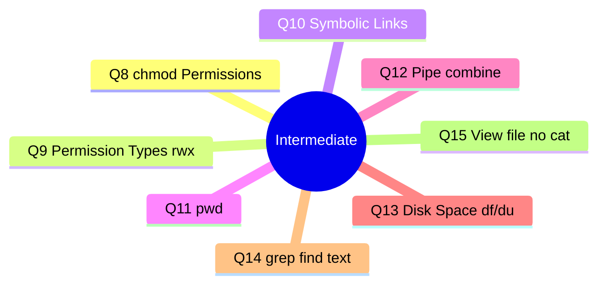
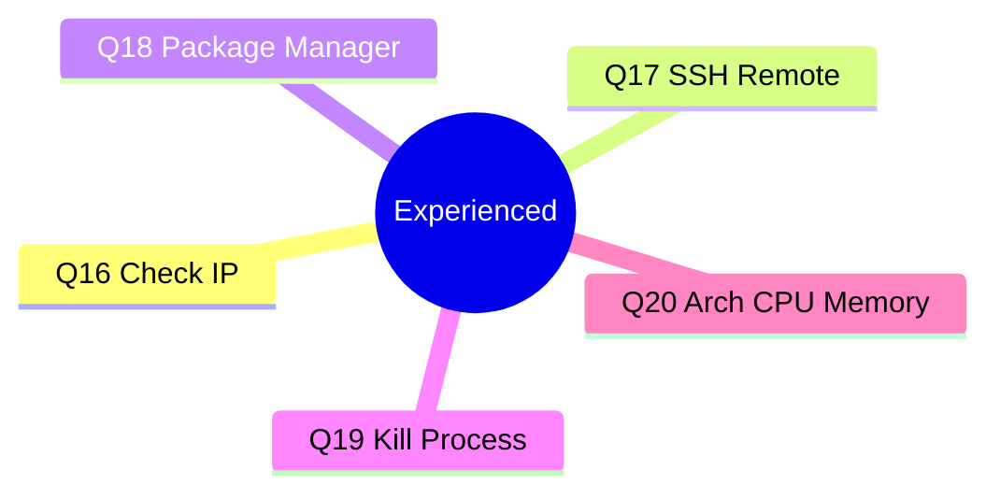

# 🐧 Linux Interview Questions & Answers — Complete Study Guide

> Quick-scan reference — cheat sheet ➜ mind maps ➜ full explanations (English + Sinhala)

---

## ⚡ Quick Command Cheat Sheet (fastest lookup)

| # | Topic | Command / Key Answer |
|---|---|---|
| Q1 | Linux vs UNIX | Linux = free/open-source Unix-like kernel; UNIX = original commercial OS |
| Q2 | Kernel | Core of OS — manages CPU, memory, devices |
| Q3 | Shell vs Bash | Shell = interpreter; Bash = a type of shell |
| Q4 | OS Components | Kernel, Shell, File System, Utilities, Hardware |
| Q5 | Init Process | First process at boot (PID 1); modern = `systemd` |
| Q6 | Find files | `find /path -name "file"` · `locate file` |
| Q7 | Soft vs Hard link | Hard = same inode; Soft = path shortcut |
| Q8 | chmod | `chmod 755 file` |
| Q9 | Permission types | r(4) w(2) x(1) — owner/group/others |
| Q10 | Symbolic links | `ln -s target link` |
| Q11 | Current path | `pwd` |
| Q12 | Pipe | `cmd1 \| cmd2` — output→input |
| Q13 | Disk space | `df -h` (disk) · `du -sh folder` (folder) |
| Q14 | Find text in files | `grep -rl "text" --include="*.txt" /path` |
| Q15 | View file (no cat) | `less` `more` `head` `tail` `tail -f` |
| Q16 | Check IP | `ip a` · `hostname -I` |
| Q17 | SSH | `ssh user@ip` — encrypted remote access |
| Q18 | Package manager | `apt` / `yum`/`dnf` / `pacman` |
| Q19 | Kill process | `ps aux \| grep name` → `kill PID` / `kill -9 PID` / `pkill name` |
| Q20 | Arch / CPU / Memory | `uname -m` · `lscpu` · `free -h` · `top`/`htop` |

---

## 🗺️ Mind Maps

### Level 1 — Freshers (System Design Basics)

### Level 2 — Intermediate

### Level 3 — Experienced

> 📌 Note: mind maps render visually on GitHub, Obsidian, Typora, VS Code (Markdown Preview Mermaid Support extension) and most modern Markdown viewers with Mermaid support.

---

## 📖 Full Explanations (English + Sinhala)

### 🟢 Level 1 — Freshers

**Q1. What is Linux, and how is it different from UNIX?**
Linux is a free, open-source, Unix-like operating system kernel created by Linus Torvalds. UNIX is the original proprietary OS. Linux is open-source and free; UNIX variants (AIX, Solaris) are commercial and closed-source.
🔸 *Linux කියන්නේ Unix ආකෘතියේම නමුත් නොමිලේ, open-source kernel එකක්. UNIX කියන්නේ මුල් වාණිජ OS එක.*

**Q2. What is a Linux Kernel? Why is it important?**
The kernel is the core of the OS that manages hardware (CPU, memory, devices) and lets software interact with hardware. Important because it controls resource allocation, process scheduling, and security.
🔸 *Kernel කියන්නේ hardware manage කරන OS හදවත — resources බෙදාහැරීම, scheduling, security control කරන නිසා වැදගත්.*

**Q3. What is a shell in Linux, and how is it different from bash?**
A shell is a command-line interpreter passing commands to the kernel. Bash is one specific, most-commonly-used shell. Others: sh, zsh, ksh.
🔸 *Shell = commands interpret කරන එක. Bash = Linux වල වැඩිපුරම use වෙන shell වර්ගය.*

**Q4. What are the basic components of a Linux OS?**
Kernel, Shell, File System, System Utilities, Hardware layer.
🔸 *Kernel + Shell + File System + Utilities + Hardware.*

**Q5. What is the init process in Linux?**
`init` is the first process started by the kernel at boot (PID 1); starts all other processes/services. Modern systems mostly use `systemd`.
🔸 *Boot වෙනකොට ආරම්භ වෙන පළවෙනි process (PID 1) — දැන් වැඩිපුරම `systemd`.*

**Q6. How do you find files in Linux?**
`find /path -name "filename"` to search by name; `locate filename` uses a pre-built index (faster).
🔸 *`find` හෝ `locate` command දෙකෙන් file search කරන්න පුළුවන්.*

**Q7. What is the difference between a soft link and a hard link?**
A hard link points directly to the same inode/data — deleting the original doesn't affect it. A soft link (symlink) is a pointer to the file path — breaks if original is deleted.
🔸 *Hard link = data එකටම direct point. Soft link = path shortcut, original delete උනොත් break වෙනවා.*

---

### 🟡 Level 2 — Intermediate

**Q8. How do you change file permissions using chmod?**
Symbolic: `chmod u+x file`. Numeric: `chmod 755 file` (owner: rwx, group: r-x, others: r-x).
🔸 *`chmod 755 file` — owner full, group/others read+execute.*

**Q9. What are the different types of permissions available?**
Read (r=4) view, Write (w=2) modify, Execute (x=1) run as program. Applies to owner, group, others.
🔸 *r(4) read, w(2) write, x(1) execute — owner/group/others කියලා 3 කොටස්.*

**Q10. How do you create and manage symbolic links?**
Create: `ln -s /path/to/target /path/to/link`. Verify: `ls -l` (shows `->`). Remove: `rm link_name` (removes only the link).
🔸 *`ln -s target link` — `ls -l` එකෙන් `->` පේනවා. `rm` කළොත් link විතරයි යන්නේ.*

**Q11. How do you check your current path/directory?**
`pwd` (print working directory) — shows the full absolute path.
🔸 *`pwd` — දැනට ඉන්න directory එකේ full path බලනවා.*

**Q12. How do you combine two commands, and what is the use of a pipe (|)?**
A pipe takes one command's output as another's input. Example: `ls -l | grep ".txt"`.
🔸 *Pipe (`|`) = එක command එකේ output එක අනිත් එකට input කරනවා.*

**Q13. How can you check for free disk space?**
`df -h` for space per mounted filesystem. `du -sh foldername` for space used by a folder.
🔸 *`df -h` (partition free space), `du -sh folder` (folder size).*

**Q14. Find files with .txt extension containing a specific string.**
`grep -l "string" *.txt` (current dir) or recursively `grep -rl "string" --include="*.txt" /path`.
🔸 *`grep -rl "text" --include="*.txt" /path` — text සහිත .txt files හොයනවා.*

**Q15. Different ways to view file content without cat.**
`less` (scrollable, best for large files), `more` (page by page), `head` (first 10 lines), `tail` (last 10 lines), `tail -f` (live/streaming), `vim`/`nano` (view+edit).
🔸 *`less`, `more`, `head`, `tail`, `tail -f` — file content බලන විවිධ ක්‍රම.*

---

### 🔴 Level 3 — Experienced

**Q16. How do you check the current IP address of your Linux server?**
`ip addr show` / `ip a` (modern). Older: `ifconfig`. Quick: `hostname -I`.
🔸 *`ip a` හෝ `hostname -I` — IP address ඉක්මනට බලාගන්න.*

**Q17. What is SSH, and how is it used to access a Linux server remotely?**
SSH is an encrypted protocol for securely connecting to/controlling a remote server. `ssh username@server_ip`. Supports key-based authentication.
🔸 *SSH = encrypted remote access protocol. `ssh user@ip`, key-based auth support.*

**Q18. What is a package manager, and why is it useful?**
Installs, updates, configures, removes software and resolves dependencies automatically. Examples: `apt` (Debian/Ubuntu), `yum`/`dnf` (RedHat/CentOS), `pacman` (Arch).
🔸 *Package manager = software install/update/remove + dependencies auto handle. `apt`, `yum/dnf`, `pacman`.*

**Q19. How do you terminate an ongoing process?**
Find PID: `ps aux | grep process_name`. Kill: `kill PID` (graceful) or `kill -9 PID` (force). Or `pkill process_name` directly.
🔸 *`ps aux | grep name` → PID → `kill PID` / `kill -9 PID` / `pkill name`.*

**Q20. How do you check system architecture and CPU/memory stats?**
Architecture: `uname -m`. CPU: `lscpu` or `cat /proc/cpuinfo`. Memory: `free -h`. Live view: `top` or `htop`.
🔸 *`uname -m` (architecture), `lscpu` (CPU), `free -h` (memory), `top`/`htop` (live view).*

---

💡 **Interview-day tip:** Run each command once on a real terminal before the interview — muscle memory beats memorized explanations. Commands ටික terminal එකේ දාලා try කරන්න, මතක තියාගන්නවට වඩා practice ප්‍රයෝජනවත්.
